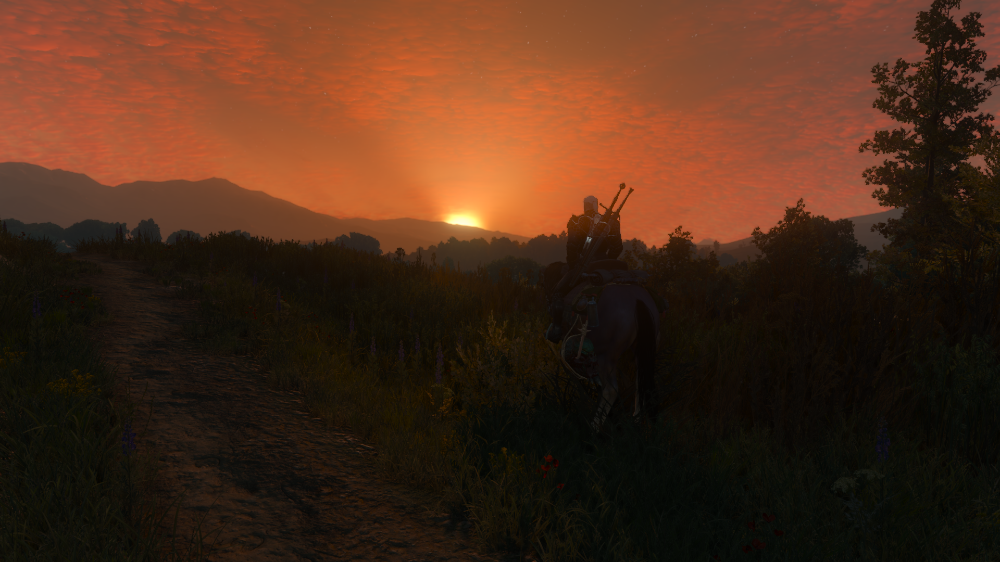

# 前言

近期去了海南旅游，有幸观赏到了美丽的日落，配上洁净的沙滩和硕果累累的椰树可以称得上是种享受。现在想想，这种美丽的晚霞也非首次目睹，然而即便是欣赏了上千次，每当通过那绚烂的大气层看向那浩瀚无垠的银河时仍会感到头晕目眩。

此外，在本人玩过的游戏中，欧卡2中的大气和云也是令人印象深刻，比如下面这张（忘了是在哪里截的了，好像是在荷兰？）。不过这个云感觉不是用噪声做的，太逼真了，层次也分明。之前特意观察过，云似乎是有多张实拍的贴图，随着时间做简单的线性插值的。

当然巫师3的大气也很美，下面这张图好像是在陶森特截的。一个题外话，GAMES104也拿类似的场景举过例子，最终的画面表现中Bloom功不可没。不过感觉这张截图中的Exponential Fog似乎用力过猛了。

既然无论是湛蓝的晴天还是翠绿兼血红的晚霞都能让我们浮想联翩，不如手动去创造一个出来。

# 参与介质和体渲染

显而易见地是，大气是一种参与介质，光会与参与介质发生以下的几种交互：

## 自发光

粒子吸收能量后释放光能就有了发光现象，对于大气可以先不考虑这种交互的影响。

## 散射

散射分为两种，首先是外散射，表现为光线被散射后脱离视线方向。然后是内散射，对于某个粒子来说，周围粒子发生外散射后一部分光线偏向了该粒子，为它带来了额外的能量。也就是说，其实只有一种散射即外散射，但是对于它发生一次或是多次的情况需要分别考虑。这里就把单次散射和多次散射建立了联系，后面会看到具体是怎么回事。

定义散射系数为$\sigma_s$，基于大气的密度在高度上的分布是不均匀的，以及粒子对不同波长的光散射率不一样这两个观察，可以知道$\sigma_s$是关于波长$\lambda$和高度$h$的函数。为了方便后续的讨论，我们希望能够将散射系数拆分为为两个函数乘积的形式，这两个函数分别以$\lambda$和$h$作为参数。选择某一高度作为基准平面（海平面），计算此时的散射系数为$\sigma(\lambda,0)$，并使用$\rho(h)$来表示介质密度随高度的分布，散射系数可表示为

$$\sigma_s(\lambda, h)=\sigma(\lambda,0)\rho(h)$$

## 吸收

介质的吸收系数用$\sigma_a$来表示，[2]中提到了它是一个概率密度函数，因此取值范围不是0到1。在一段极短距离$dt$上（其实应该用导数符号的，偷个懒），辐照度的吸收量即

$$dL_o=-\sigma_a L_i dt$$

解微分方程即得到某段距离$d$上的能量保留率

$$e^{-\int_0^d\sigma_a(p+\omega t, \omega) dt}$$

同样的，吸收系数也是关于波长$\lambda$和高度$h$的函数，我们也会使用它的分解形式来计算。

## 透射率

外散射也可以理解为一种衰减，不妨考虑一条光线沿直线传播，将散射系数$\sigma_s$加上吸收系数$\sigma_a$，再定义湮灭系数$\sigma_t=\sigma_a+\sigma_s$。仿照计算能量保留率的思路，可以算出来光线透过某个介质后的能量还剩下多少，称之为透射率Transmittance：

$$T=e^{-\int_0^d\sigma_t(p+\omega t, \omega) dt}$$

由于指数函数，很容易可以看出某一段路径的Transmittance等价于多段子路径Transmittance的乘积。同时把指数上的积分单独拎出来看的话，它也等价于所有子路径上积分值的和。不妨为这个积分（不考虑符号）起个名字，叫光学深度$\tau$，数学上即为对应的积分：

$$\tau=\int_0^d\sigma_t(p+\omega t, \omega) d$$

只要能算出$\tau$，透射率自然就能拿到了。不过在实现大气散射的过程中，只需要知道Transmittance的计算方法就行了，我们不会去单独计算和存储光学深度。

## 相位函数

我们已经定义了散射系数，它的意义是在某一点上能量被散射的概率，那被散射的能量在不同的方向上是如何分布的呢？这就要请出相位函数了，它是一个在球面上积分为1的函数，描述了某个方向上逃逸的散射光能量的百分比。为了简化问题，假设相位函数是各向同性的，定义为$phase(\theta)$，其中$\theta$即为外散射方向与入射方向的夹角。

## 散射函数

将散射系数与相位函数相乘就得到了我们所需要的散射函数

$$S=\sigma_sphase(\theta)$$

## 常见的散射方式

大气中常见的两种散射为瑞利散射和米氏散射，他们对应了不同的基准散射系数$\sigma(\lambda,0)$、相位函数$phase(\theta)$和密度分布函数$\rho(h)$。

### 瑞利(Rayleigh)散射

瑞利散射发生于粒子远小于波长的情况下，它的方向性较弱，但是散射率随波长的变化较大。瑞利散射对于蓝光的散射率很大，因此有了蓝天；它对红光的散射较弱，在傍晚由于蓝光由于传播距离增大和多次散射而几乎衰减殆尽，而红光则能够顺利地到达地面，因此傍晚的天空呈玫瑰红色。瑞利散射和吸收不会同时发生。瑞利散射的各种属性参考本节的表格。

### 米氏(Mie)散射

当大气中粒子的直径与辐射的波长相当时则发生米氏散射。它有很强的方向性，不过对于不同波长的光基本一视同仁。同时，发生米氏散射的粒子同时也会发生吸收，且散射和吸收共用一个密度随高度的分布函数。米氏散射的各种属性也请参考本节的表格。

### 光与介质的其他交互方式

为了实现更真实的大气，我们还需要考虑臭氧层，它的特点是不发生散射只发生吸收。

### 参数速查表

通过上面的描述，可以总结出我们需要的所有参数分别是：基准平面处的散射系数$\sigma_s(\lambda,0)$、密度随高度的分布$\rho(h)$、
基准平面处的吸收系数$\sigma_a(\lambda,0)$以及相位函数$phase(\theta)$。两种散射的高度函数都是以指数衰减的形式定义的，使用标高$H$来进行归一化，而臭氧层的密度由于不是随高度单调变化的，所以它的$\rho(h)$会有所不同。之后会使用上标来区分这几种交互方式。

对于米氏散射而言，它的相位函数带有额外的各向异性参数$g$，用于调节散射波瓣的形状。

散射系数和吸收系数在不同的参考资料中有细微的差别，下面的具体值与参考资料[1]相同。

|| Rayleigh | Mie | Ozone |
| --- | --- | --- | --- |
| $\sigma_s(\lambda,0)$ | $(5.802,13.558,33.1) \times 1e^{-6}$ | $(3.996,3.996,3.996) \times 1e^{-6}$ | 无 |
| $\sigma_a(\lambda,0)$ | 无 | $(4.40,4.40,4.40) \times 1e^{-6}$ | $(0.650,1.881,0.085) \times 1e^{-6}$ |
| $phase(\theta)$ | $\frac{3}{16\pi}(1+\cos^2\theta)$ | $\frac{3}{8\pi}\frac{1-g^2}{2+g^2}\frac{1+\cos^2\theta}{(1+g^2-2g\cos \theta)^{3/2}}$ | 无 |
| $\rho(h)$ | $e^{-h/H}, H=8500m$ | $e^{-h/H}, H=1200m$ | $max(0,1-\frac{\|h-c\|}{w}),c(enter)=25km,w(idth)=15km$ |

### 通用的相位函数

查阅资料发现，其实还有一些更通用的相位函数，比如HG(Henyey-Greenstein)和Draine相位函数。米氏散射的相位函数就是Draine（见下式）相位函数在$\alpha=1$时的特例：

# 单次散射模型

有了上面对于某种粒子的散射与吸收的模型，我们来着手考虑光从太阳到相机的这段路途上发生了什么。在不考虑自发光的假设下，只需要累加视线上所有粒子的内散射乘上该粒子到相机中间的透射率即可得到来自大气的辐照度，表达为数学式如下：

$$L_i(c,v)=\int_{t=0}^{||p-c||}T(c,c+vt)L_{in-scattering}(c+vt,-v)\sigma_s dt$$

上式中的$L_{in-scattering}(c+vt,-v)$包含了某个粒子的所有内散射，即周围粒子传递给该粒子的能量乘以相位函数的总和。它实际上是一个球面上的积分，显然很不好算，我们不妨来考虑一个简化的模型：对于积分路径上的粒子，我们只考虑有多少阳光直直地穿过大气并到达了这个粒子，它散射到视线方向上的光又有多少成功透过大气到达了相机。也就是说模型统计了如下路径的贡献：太阳$\rarr$透射$\rarr$粒子$\rarr$散射$\rarr$透射$\rarr$相机，称之为单次散射模型。同样的，我们只需要在视线上做如下的积分即可，下面的示意图来自[1]：

# 多次散射模型

# 参考资料

1. [实时大气散射渲染实战](https://zhuanlan.zhihu.com/p/595576594)
2. [Physically Based Rendering：体积散射](https://yangwc.com/2020/04/19/VolumeScattering/)
3. [Supplemental: An Approximate Mie Scattering Function for Fog and Cloud Rendering](https://research.nvidia.com/labs/rtr/approximate-mie/publications/approximate-mie-supplemental.pdf)