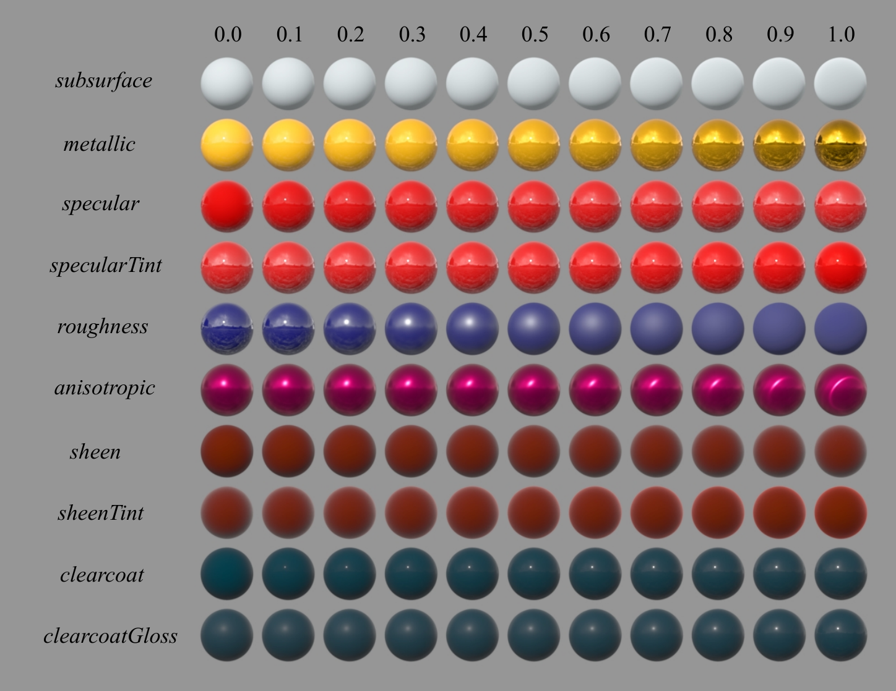
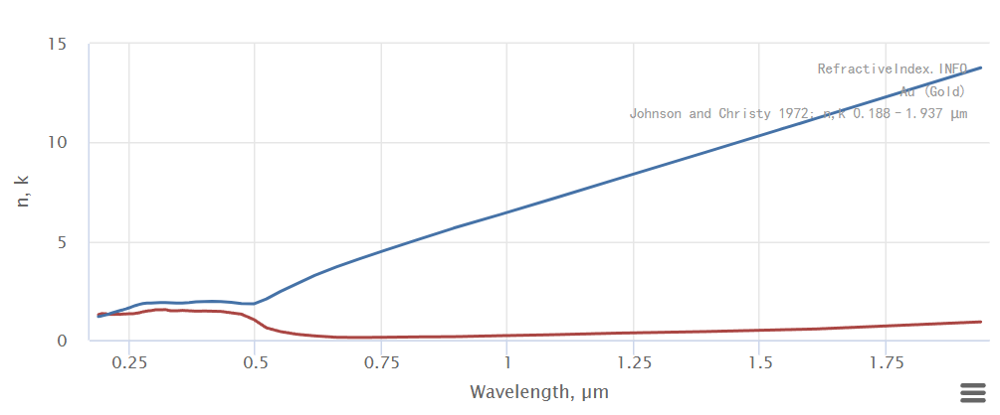
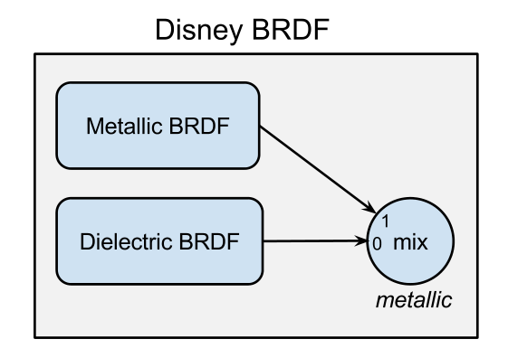
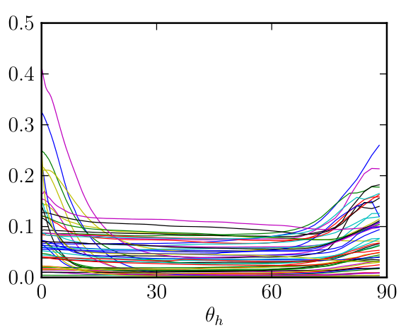
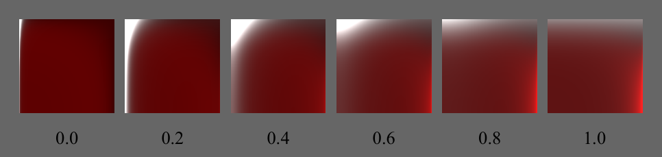
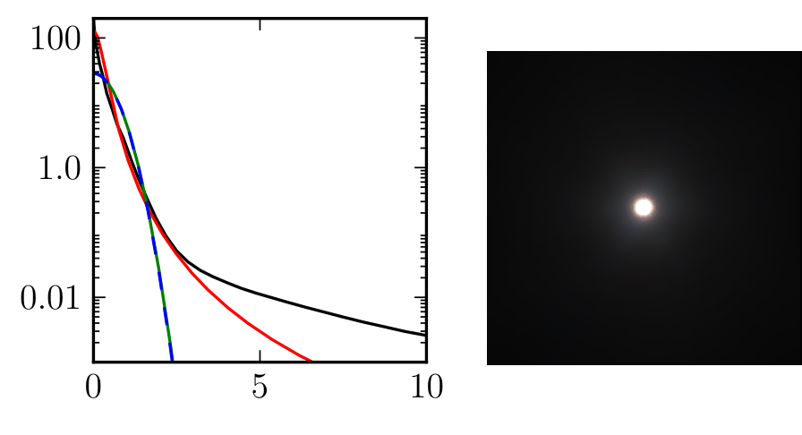
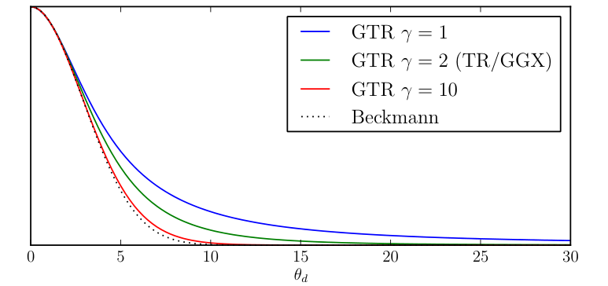

$$
\newcommand{\d}{\mathrm{d}}
\newcommand{\norm}[1]{\left\| #1 \right\|}
$$

# 前言

最近突然又想去搓一个离线渲染器作为玩具项目了，趁机深入看了下Disney Principled BSDF，也算是又从头学了一遍PBR，谨将所学的东西略微记下，以便后续查阅。

# 基本定义

由于Disney BSDF涉及大量的公式，这里有必要重新对于所有的公式和定义进行澄清。

## NDF

法线分布函数NDF究竟是什么？之前我的视线总是聚焦于具体的公式如Beckmann，GGX和GTR等等，很少会去关注NDF的定义。其实在不久之前，我还以为NDF就是法线分布的pdf，满足半球面上的积分为一即可，然而NDF的定义却并非如此。

 [1]中对于NDF的描述是 `the statistical distribution of surface normals m over the microsurface`，这里的$\mathrm{m}$指的就是微观法线，也就是我们常说的半程向量$\mathrm{h}$。乍一看这个定义似乎说的还是pdf，但NDF实际上是用微观面积与宏观面积的比值来定义的。具体来说，定义宏观面积的微元为$\mathrm{d}A$，微观法线$\mathrm{m}$对应的立体角微元为$\mathrm{d}\mathrm{\omega}_m$，那么$D(\mathrm{m})\mathrm{d}\mathrm{\omega}_m\mathrm{d}A$就等于（微观）法线朝向为$\mathrm{m}$微平面的总面积，因此$D(\mathrm{m})$项可以写为，其中$\mathrm{d}A_m$代表微平面的面积：

$$
D(\mathrm{m})=\frac{\d A_m}{\d \mathrm{\omega}_m\mathrm{d}A}
$$
然后来看下$D$的归一化条件，首先易得微平面投影面积的积分应该为$\mathrm{d}A$：

$$
\mathrm{d}A=\int(n \cdot m)\mathrm{d}A_m
$$
将$D(\mathrm{m})$的定义带入后可得真正的归一化条件：

$$
\int_{\Omega}(n \cdot m)D(\mathrm{m})\mathrm{d}\mathrm{\omega}_m=1
$$
之后就不要再天真地把$D(\mathrm{m})$项看作pdf了，而将其称为面积密度则更合适。

**P.S.** [1]中Walter et al. 实际上给出了更严格的归一化条件，即对于任意的方向$\mathrm{v}$需要满足：
$$
\int_{\Omega}(v \cdot m)D(\mathrm{m})\mathrm{d}\mathrm{\omega}_m=(v \cdot m)
$$

## Shadowing-Masking Function G

$G$项是为了能量守恒而加上的，用于描述有多少的微平面是在入射方向$\mathrm{}$$\mathrm{i}$和出射方向$\mathrm{}$$\mathrm{o}$上都是可见的，$G$要满足的三个条件分别是：

1. 位于0-1之间，这个没啥问题
2. 可逆性reciprocity， 交换$\mathrm{i}$和$\mathrm{o}$不影响$G$的值
3. 微平面始终只有一侧是可见的，即当$(\mathrm{i} \cdot \mathrm{n})(\mathrm{i} \cdot \mathrm{m}) \le 0$（$\mathrm{o}$同理）时$G$为0

由于$G$项依赖于微表面的细节，因此一般情况下不存在解析解，现有的模型如Smith包含了大量的统计近似和几何简化，这里就不再赘述。

Smith中为了满足可逆性，特意将$G$项设计为了可分离的形式（这似乎是个很通用的技巧，Kulla-Conty Approximation也是这么干的），即$G(\mathrm{i},\mathrm{o},\mathrm{m})=G_1(\mathrm{i},\mathrm{m})G_1(\mathrm{o},\mathrm{m})$。

## 微平面BSDF模型

既然已经准备深入PBR了，那微平面模型的推导肯定少不了，紧跟[1]的思路，可以得到一看看起来非常吓人的宏观表面BSDF积分定义，注意不是渲染方程的那个积分！

$$
f_s(\mathrm{i},\mathrm{o},\mathrm{m})=\displaystyle \int \left| \dfrac{\mathrm{i} \cdot \mathrm{m}}{\mathrm{i} \cdot \mathrm{n}} \right| f_s^m(\mathrm{i},\mathrm{o},\mathrm{m}) \left| \dfrac{\mathrm{o} \cdot \mathrm{m}}{\mathrm{o} \cdot \mathrm{n}} \right| G(\mathrm{i},\mathrm{o},\mathrm{m}) D(\mathrm{m}) \d\mathrm{\omega}_m \label{eq:1} \tag{1}
$$

其中$f_s^m(\mathrm{i},\mathrm{o},\mathrm{m})$为微平面本身的BSDF，虽然常用的模型都假设了微表面为镜面，但是这里暂时先只列出一般形式，这也是不把$\mathrm{m}$直接写作$\mathrm{h}$的原因。

为了搞懂这个式子，先关注后面的部分，$G$和$D$的乘积代表了微观法线朝向为$\mathrm{m}$的微平面面积之和占宏观面积的比例，这点很好理解。

最神秘的是那两个点积构成的系数，它们实则充当了宏观与微观间的桥梁，按照论文的意思就是，第一个系数会把incident irradiance从macro尺度转换到micro，第二个系数会把radiance转换回macro尺度。尝试着来理解下为什么要用到这两个系数。

### 第一个系数

宏观表面是与入射方向$\mathrm{i}$是成角度的，除以$(\mathrm{i} \cdot \mathrm{n})$，是为了抵消这个角度带来的衰减，还原真正的incident irradiance，也就是垂直辐照度。微观表面的法线也与入射方向$\mathrm{i}$有角度，既然有了真正的incident irradiance，那么只需要再乘上$(\mathrm{i} \cdot \mathrm{m})$就能得到微表面接收到的irradiance了。这两步合起来就是第一个系数了。

### 第二个系数

经过实际微表面的反射后就是出射的radiance了，不妨以radiant exitance（也就是出射的irradiance）作为桥梁把radiance从微观尺度转换为宏观尺度的数值。从radiance的定义出发，只要乘上$\mathrm{d}\mathrm{\omega}_o(\mathrm{o} \cdot \mathrm{m})$就能得到radiant exitance了；同样，radiant exitance除以$\mathrm{d}\mathrm{\omega}_o(\mathrm{o} \cdot \mathrm{n})$就是宏观的radiance了。这样我们就得到了第二个系数。

### 微表面的BSDF（BRDF+BSDF）

虽说上面是一般的式子，但是为了方便，大多数模型都会假定微平面是完全光滑的，只遵从Fresnel和Snell定律进行反射和折射。设$\rho(\mathrm{i},\mathrm{m})$代表散射的比例，$\mathrm{s}(\mathrm{i},\mathrm{m})$为理论上应该散射的方向，那么镜面的BSDF可以定义为：
$$
f_s^m(\mathrm{i},\mathrm{o},\mathrm{m})=\rho\dfrac{\delta_{\omega_o}(\mathrm{s},\mathrm{o})}{\left| \mathrm{o} \cdot \mathrm{m} \right|} \tag{2}
$$
上式中$\delta_{\omega_o}(\mathrm{s},\mathrm{o})$为仅在$\mathrm{s}$处有值的Dirac函数，分布上的点积是为了保证[能量守恒](https://en.wikipedia.org/wiki/Bidirectional_reflectance_distribution_function#Physically_based_BRDFs)而加上的。接下来就是考虑如何把这个式子应用到(1)中。

既然已经假定微表面是镜面了，半程向量$\mathrm{h}(\mathrm{i},\mathrm{o})$的概念也就可用了，用$\mathrm{h}$替代$\mathrm{s}$并带入到(2)中可得(3)。注意这里乘上Jacobian，是因为Dirac本身只有在积分时才是有意义的，(2)式只能算是一个简单写法；$\mathrm{s}$又与积分变量$\mathrm{o}$相关，所以在进行代换时需要乘上Jacobian才能保持积分值不变。
$$
f_s^m(\mathrm{i},\mathrm{o},\mathrm{m})=\rho(\mathrm{i},\mathrm{m})\dfrac{\delta_{\omega_o}(\mathrm{h}(\mathrm{i},\mathrm{o}),\mathrm{m})}{\left| \mathrm{o} \cdot \mathrm{m} \right|} \norm{\dfrac{\partial\mathrm{\omega}_h}{\partial\mathrm{\omega}_o}} \tag{3}
$$

#### Reflection BRDF

[1]和[3]中分别给出了Jacobian的计算方法，个人认为[3]中的比较清晰，在此复述一遍。下面的示意图来自[3]，注意图中的$\mathrm{o}$和$\mathrm{i}$和我们讨论中的定义相反，$\mathrm{m}$就是半程向量。下面会先按照图中给出的符号进行推导，最后再替换为我们的符号。


从几何关系中可以很容易看出固定$\mathrm{o}$时并移动$\mathrm{m}$时，$\d \theta_i=2\d \theta_m$，然后是比较有意思的一步，直接以$\mathrm{o}$而非$\mathrm{m}$作为up vector来建立球面坐标系，这样子$\theta_i$和$\theta_m$就成$\mathrm{i}$和$\mathrm{m}$与$\mathrm{o}$的夹角了，另外在retro reflection的情况下还能得到$\theta_i=\theta_m=0$，然后很容易就能看出（解一个微分方程）$\theta_i=2\theta_m$，将立体角表示为球坐标后开始计算Jacobian：

$$
\begin{aligned}
\dfrac{\d\mathrm{\omega}_h}{\d\mathrm{\omega}_i}
&= \dfrac{\sin \theta_m \d \theta_m \d \phi_m}{\sin \theta_i \d \theta_i \d \phi_i} \\
&= \dfrac{\sin \theta_m \d \theta_m \d \phi_m}{\sin 2\theta_m (2\d \theta_m) \d \phi_m} \\
&= \dfrac{\sin \theta_m}{4\sin \theta_m \cos \theta_m } \\
&= \dfrac{1}{4\cos \theta_m } \\
&= \dfrac{1}{4(\mathrm{i} \cdot \mathrm{m})} = \dfrac{1}{4(\mathrm{o} \cdot \mathrm{m})}
\end{aligned}
$$
来计算微表面的反射部分，直接把菲涅尔项和Jacobian带进去即可。注意$(\mathrm{i} \cdot \mathrm{h}_r)=(\mathrm{o} \cdot \mathrm{h}_r)$。
$$
f_r^m(\mathrm{i},\mathrm{o},\mathrm{m})=F(\mathrm{i},\mathrm{m})\dfrac{\delta_{\omega_o}(\mathrm{h}_r,\mathrm{m})}{4(\mathrm{i} \cdot \mathrm{h}_r)^2} \tag{4}
$$

#### Refraction(Transmission) BRDF

虽然[1]对于这部分的推导使用了折射半程向量$\mathrm{h}_t$的概念，但这里的$\mathrm{h}_t$实际上指的就是微平面的法线。这里还要做一些补充，笔者也是在写的时候才意识到，就是微平面$\mathrm{m}$实际上只是一个统计和建模上的概念，因为一个无限小平面的朝向是不可知的。唯一能做的就是从镜面的假设出发，通过实际观测到的$\mathrm{i}$和$\mathrm{o}$来算一个半程向量$\mathrm{h}$，并通过Dirac函数来筛选出朝向正好为$\mathrm{h}$的平面。因此，$\mathrm{h}_r$、$\mathrm{h}_t$和$\mathrm{m}$在实际计算时都是同一个向量，在折射的情况下称其为"*半程向量*"实际上是不名副其实的，不过为了推导上的统一我们就不再引入新的符号了。


如何计算微观法线呢？首先从上图的左边可以观察到$\mathrm{i}$和$\mathrm{o}$垂直于$\mathrm{h}_t$分量的模长分别为对应折射角的正弦值，同时分量的方向相反。根据斯涅尔定律$\eta_i\sin\theta_i=\eta_o\sin\theta_o$，两者相加正好完全抵消，剩下的部分正好是与微观法线共线的，做一次归一化就行了。记归一化与未归一化的半程向量分别为$\mathrm{h}_t$和$\vec{\mathrm{h}}_t$，则
$$
\vec{\mathrm{h}}_t=-(\eta_i\mathrm{i}+\eta_o\mathrm{o}), \mathrm{h}_t(\mathrm{i},\mathrm{o})=\frac{\vec{\mathrm{h}}_t}{\Vert \vec{\mathrm{h}}_t \Vert} \tag{5}
$$
至于Jacobian，[1]给出了几何的解释，如上图的右半部分。Gemini也给出了一个大概的推导，为了转换为立体角之间的关系，需要得到$\vec{\mathrm{h}}_t$和$\mathrm{o}$变化时微分面积的对应关系。首先在(5)式$\vec{\mathrm{h}}_t$的两端求导，得到$\d \vec{\mathrm{h}}_t=\eta_o \d \mathrm{o}$，这说明当$\mathrm{o}$变化时$\vec{\mathrm{h}}_t$扫过的微分面积是$\mathrm{o}$扫过面积的$\eta_o^2$倍。但这个面积是垂直与$\mathrm{o}$的，还要投影到垂直于$\vec{\mathrm{h}}_t$的方向上，因此还要乘上$\left| \mathrm{o} \cdot \vec{\mathrm{h}}_t \right|$才是真正的微分面积。根据立体角的定义，还要除以半径的平方，而$\norm{\vec{\mathrm{h}}_t}=\mathrm{h}_t \cdot \vec{\mathrm{h}}_t$，最终可以得到Jacobian为：
$$
f_t^m(\mathrm{i},\mathrm{o},\mathrm{m})=(1-F(\mathrm{i},\mathrm{m}))\dfrac{\delta_{\omega_o}(\mathrm{h}_t,\mathrm{m}) \eta_o^2}{(\eta_i(\mathrm{i} \cdot \mathrm{h}_t)+\eta_o(\mathrm{o} \cdot \mathrm{h}_t))^2} \tag{6}
$$
[4]中的一段也与这段推导相呼应：

```
Snell’s law describes the bending of rays, but less obviously, it also describes the spreading of rays. Specifically, the apparent radiance of a refracted ray will be scaled by η2 which, as Veach shows [Vea97], is equivalent to the change in projected solid angle.
```

当然，从上面的式子我们也能看出BTDF是不满足可逆性的，因为Radiance被缩放了$\eta^2$倍，双向的BTDF关系如下：
$$
\dfrac{f_t^m(\mathrm{i},\mathrm{o},\mathrm{m})}{\eta_o^2}=\dfrac{f_t^m(\mathrm{o},\mathrm{i},\mathrm{m})}{\eta_i^2}
$$

### BSDF

有了(1)、(4)和(6)式，我们终于能写出最终的BSDF了，由于Dirac函数的存在，宏观表面的BSDF可以看作是反射和折射两部分的叠加：
$$
f_s(\mathrm{i},\mathrm{o},\mathrm{n})=f_r(\mathrm{i},\mathrm{o},\mathrm{n})+f_t(\mathrm{i},\mathrm{o},\mathrm{n}) \tag{7}
$$
经过消元，反射部分为，就是我们熟悉的Cook-Torrance BRDF：
$$
f_r(\mathrm{i},\mathrm{o},\mathrm{n})=\dfrac{F(\mathrm{i},\mathrm{h}_r)G(\mathrm{i},\mathrm{o},\mathrm{h}_r)D(\mathrm{h}_r)}{4 \left| \mathrm{i} \cdot \mathrm{n} \right| \left| \mathrm{o} \cdot \mathrm{n} \right|} \tag{8} \
$$

折射部分基本上没什么可消元的，就是单纯把微平面的$f_t^m$带进去即可：
$$
f_t(\mathrm{i},\mathrm{o},\mathrm{n})=\left| \dfrac{\mathrm{i} \cdot \mathrm{h}_t}{\mathrm{i} \cdot \mathrm{n}} \right| \left| \dfrac{\mathrm{i} \cdot \mathrm{h}_t}{\mathrm{o} \cdot \mathrm{n}} \right| \dfrac{\eta_o^2(1-F(\mathrm{i},\mathrm{h}_t))G(\mathrm{i},\mathrm{o},\mathrm{h}_t)D(\mathrm{h}_t)}{(\eta_i(\mathrm{i} \cdot \mathrm{h}_t)+\eta_o(\mathrm{o} \cdot \mathrm{h}_t))^2}  \tag{9}
$$

到这里，基本定义部分就告一段落，终于可以开始探索Disney BSDF了。

# Disney Principled BRDF

这是Disney在2012年提出的模型，他们通过观察MERL 100中的材质，提出了一种不那么物理但是对于艺术家更加友好的模型。该模型共有1个颜色参数和10个标量参数，并且一般情况下所有的参数都在0到1之间。这里就不再复述Disney分析材质的过程，他们得出的结论非常有意思，有兴趣的朋友可以看看原论文[4]。下面是该模型的效果展示。



## 前置知识

首先我们要明确，光打到表面后的去向只有两种可能：

- 在表面就被反射
- 进入物体内部

然后我们还需要区分电介质dielectric和金属metal，虽然在实时渲染中用的PBR模型一般会根据金属度去混合一个diffuse和一个specular，但事实上这个混合并不符合物理，因为一个材质要么是电介质要么是金属，而这两者呈现出颜色的物理本源大相径庭。

在继续接下来的讨论之前需要声明，由于笔者本人并非物理出身，对于Fresnel Equation的了解还停留在初级阶段，下面的陈述也大致是由AI佐证的，并不保证严谨性。对于Fresnel方程完整的讨论见Sébastien大神的博客[6]。

首先每个材质都有一个折射率（P.S. 折射率本身实际上是用真空光速与介质中光速的比值来定义的），它实际上是一个形为$n+ik$的复数，其中$k$是一个叫做消光系数(extinction coefficient)的玩意，它大致代表了光线在介质衰减的速度。电介质的消光系数一般非常小，而金属的消光系数则很大。

### 金属

但是！消光系数$k$大，并不意味着大部分入射光会被金属吸收。金属材质中有大量的自由电子，入射光会与这些电子发生两种交互[7]，要么是被吸收并转化为热能，要么是被重新辐射（反射）出去。电子云还会产生一个反向的电场，阻止光线的继续深入。同时由于光波在金属中会快速衰减，为了保持能量守恒，绝大部分的能量都会走上第二条路径，也就是被反射出去。从下面$F_0$的计算公式也能看出金属的反射能力非常强，当$k$很大时，$F_0$会趋近于1。
$$
F_0=\dfrac{(n-1)^2+k^2}{(n+1)^2+k^2} \tag{10}
$$
那既然反射这么强，为啥金属还会有颜色呢？实际上，金属的$n$和$k$都是与波长高度相关的，比如下面黄金的数据：



也就是说，金属会在表面立即将一部分波长的电磁波立即转换为热能，剩下的部分就被原封不动地反射出去了，这就是金属带有颜色的原因。

### 电介质

与金属截然不同，电介质的消光系数$k$通常极小（接近 0）。这意味着光线大部分都折射进入了物体内部。一旦光线进入内部，它便开始了在物质微观结构间的行进。在这个过程中，光线会发生无数次的散射。而在散射的路径上，特定波长的光子会被物质内部的色素或分子结构选择性吸收并转化为热能。那些幸存下来、未被吸收的光波，在经过多次散射后，最终会从表面重新射出。这部分从内部逃逸出来的光，携带了物质内部的信息，形成了我们所看到的颜色。

而我们平常说的漫反射颜色，实际上是忽略了多数行进距离较远的光线，进而认定出射点等同于入射点，完成了对于上述复杂的次表面散射过程的近似。

另外从$F_0$的计算公式来看，电介质表面仍然会发生直接反射，虽然$F_0$非常小，但这部分能量不容忽视。这一点也是Disney的工程师们在设计BRDF的时候要考虑的事情。

## 定义

**P.S.** Disney还贴心地为大家设计了一个BRDF Explorer用于快速可视化和探索常用的BRDF模型，不过在Windows上编译的话好像需要Qt环境，如果不想编译的话还是可以作为Disney BRDF官方实现来参考的，详见[8]。

### 颜色

让我们来一览Principled BRDF具体的定义，先从最基础的部分入手。前面我们已经提到过，Disney BRDF并不追求完全的物理，所以该模型会使用金属度`metallic`去混合电介质的BRDF和金属的BRDF，如下图所示：



Disney BRDF最有趣的一点在于它只有一个颜色参数`baseColor`，它既用于控制金属反射的颜色，又用于控制电介质漫反射的颜色。按照之前的分析，电介质的高光是消色差也就白色的，而且它们的$F_0$一般非常小，所以Disney基于电介质平均的$F_0$在$0.04$左右的观察，将`specular`参数设置为了$0.08 \times F_0$，这样当`specular`为$0.5$时正好代表一般的电介质。另外美术也许会想要让这个高光不是消色差的，Disney BRDF引入了`specularTint`来控制高光的颜色，这个值越接近$1$，高光颜色就越向`baseColor`趋同（`sheenTint`也是这个逻辑）。需要注意的是，这个`specular`**只影响电介质**，金属的高光是仅由`baseColor`来控制的！

另外，模型中实际上存在两个Specular Lobe，一个是电介质的Specular Lobe，另一个是金属的Specular Lobe。一开始笔者还对这一点存有疑问，觉得这两个部分应该分开计算。后来想了想，既然我们已经允许电介质与金属的混合了，还有`specularTint`来控制非金属的高光，除掉颜色成因的差异之外两者的微表面反射原理是一致的，完全可以共用同一个BRDF的计算公式。在实践中，只需要根据`metallic`和`specular`对颜色做混合就行了。下面是颜色计算的代码，可以清晰地看出混合的逻辑。tint_color是使用luminance对base_color进行归一化的结果。

```c++
inline Color CalculateTint(const Color &base_color)
{
    double luminance = dot(Vec3(0.3, 0.6, 0.1), base_color);
    return luminance > 0.0 ? base_color * (1.0 / luminance) : Color::one();
}

inline Color CalculateF0(const Color &base_color, const Color &tint_color, double metallic, double specular,
                         double specular_tint)
{
    return lerp(specular * 0.08 * lerp(Color::one(), tint_color, specular_tint), base_color, metallic);
}
```

### 漫反射

Disney观察到不少漫反射材质有着很明显的掠射角自反射（grazing retroreflection），如下图所示，其中$\theta_d$是$\mathrm{h}$与$\mathrm{n}$的夹角。一种可能的原因是，由于表面非常粗糙，所以与菲涅尔公式预测的相反，处于掠射角时折射的比例反而会增大，这些折射的光线在最终表现为一个宏观的specular peak。



为了还原这个现象，Disney为Lambert Diffuse模型加上了一个与粗糙度相关的权重来模拟这种现象，具体的公式如下，其中$\theta_l$和$\theta_v$分别相对于宏观法线$\mathrm{n}$夹角的余弦。
$$
f_d=\frac{\text { baseColor }}{\pi}\left(1+\left(F_{D 90}-1\right)\left(1-\cos \theta_l\right)^5\right)\left(1+\left(F_{D 90}-1\right)\left(1-\cos \theta_v\right)^5\right) \tag{11}
$$
$F_{D 90}$与粗糙度相关：
$$
F_{D 90}=0.5+2 \cdot roughness \cdot \cos^2\theta_d \tag{12}
$$
该模型的效果如下，当粗糙度增大时，BRDF切片右下角的亮度明显增加，而在材料比较光滑时，根据Fresnel定律右下角则较暗。



### D

真实的高光具有非常宽广的分布，比如金属铬(Chrome)的高光，对应下面左图中的黑色线条：



而现有的GGX（也就是Trowbridge-Reitz）和Beckmann都无法很好地拟合这个分布“长尾”的特征。Disney因此根据GGX和Berry分布的特点，创造了GTR也就是Generalized-Trowbridge-Reitz分布，公式和绘图如下，其中$c$是未知的归一化常数，$\alpha$是与粗糙度相关的参数。可以看到GTR有着很优秀的且可调节的长尾特征：
$$
D_{\text{GTR}}=\frac{c}{(\alpha^2 \cos^2 \theta_h + \sin^2 \theta_h)^\gamma} \tag{13}
$$


当然，这个$\gamma$参数也是要事先确定下来的，Principled BRDF中一共会使用两个不同的Specular Lobes，分别是对应主要材质的primary lobe，$\gamma=2$，这个实际上就是GGX，以及对应清漆的secondary lobe，$\gamma=1$。

另外这篇论文中也为笔者解答了一个此前困惑许久的问题：为啥有些实时渲染的模型中会有一个叫做perceptual roughness的玩意儿？原来，Disney在试验时发现令$\alpha=roughness^2$会让粗糙度的变化更加`perceptually linear`，因此提出使用平方后的perceptual roughness即$\alpha$来替换GGX中原来的粗糙度。这是一个经验性的改进，没有涉及数学上的推导。

从前置知识和定义部分中我们知道，`specular`参数作为电介质垂直入射时的反射强度，实际上表示的就是归一化的折射率IOR。根据$F_0$的公式(10)来看，`specular`越高意味着IOR也越高，同时`specular`等于0.5时对应的IOR为1.5，这也是个常见的反射率数值，说明归一化是合理的。对于清漆clearcoat层，Disney让IOR固定为了1.5，在这种情况下$F_0$只有0.04，只占反射能量的很小一部分，因此在最终的计算里clearcoat和基础材料的BRDF只要简单相加而无需进行混合。`clearcoat`参数也像`specular`一样做了归一化处理。

#### 归一化

论文的附录部分给出了GTR归一化后的公式，推导思路就是根据之前介绍过的$D$的定义来解出归一化常数$c$即可。
$$
D_{\mathrm{GTR}}\left(\theta_h\right)=\frac{(\gamma-1)\left(\alpha^2-1\right)}{\pi(1-\left(\alpha^2\right)^{1-\gamma})} \frac{1}{\left(1+\left(\alpha^2-1\right) \cos ^2 \theta_h\right)^\gamma}  \tag{14}
$$
对于primary lobe和secondary lobe来说，更具体的公式如下，由于$\gamma=1$时GTR实际上是未定义的，因此下面secondary lobe的式子实际上取了极限：
$$
\begin{aligned}
D_{\mathrm{GTR}_{2}}\left(\theta_h\right)&=\frac{\alpha^2}{\pi} \frac{1}{(1+(\alpha^2-1) \cos ^2 \theta_h)^{2}}\\
D_{\mathrm{GTR}_{1}}\left(\theta_h\right)&=\frac{\alpha^2 -1}{\pi\log \alpha^2} \frac{1}{(1+(\alpha^2-1) \cos ^2 \theta_h)}
\end{aligned} \tag{15}
$$
代码如下：

```cpp
inline double GTR1(double NdotH, double a)
{
    if (a >= 1)
        return inv_pi;
    double a2 = sqr(a);
    double t = 1 + (a2 - 1) * sqr(NdotH);
    return (a2 - 1) / (pi * std::log(a2) * t);
}

inline double GTR2(double NdotH, double a)
{
    if (a >= 1)
        return inv_pi;
    double a2 = sqr(a);
    double t = 1 + (a2 - 1) * sqr(NdotH);
    return a2 / (pi * sqr(t));
}
```

#### 各向异性

为了引入各向异性，首先要建立局部坐标系，$\mathrm{n}$作为up vector，其余两个基向量分别为$\mathrm{x}$和$\mathrm{y}$。`anisotropic`项控制在$\mathrm{x}$和$\mathrm{y}$上的roughness的缩放，具体的转换如下：
$$
\begin{aligned}
aspect&=\sqrt{1-0.9 \cdot anisotropic}\\
\alpha_x&=roughness^2 / aspect\\
\alpha_y&=roughness^2 \cdot aspect
\end{aligned}
$$
为了把GTR变成各向异性的，直接用$\frac{\cos^2 \phi}{\alpha_x^2}+\frac{\sin^2 \phi}{\alpha_x^2}$来代替$\frac{1}{\alpha^2}$带入到primary lobe，其中$\theta_h$和$\phi_h$为$\mathrm{h}$在局部坐标系中的球面坐标。由于只有primary lobe会是各向异性的，因此对于Anisotropic GTR的讨论全都假定$\gamma=2$。
$$
D_{\mathrm{GTR}_{aniso}}\left(\theta_h\right)=\frac{1}{\pi} \frac{1}{\alpha_x \alpha_y} \frac{1}{(\sin^2 \theta_h (\cos^2 \phi_h/\alpha_x^2 + \sin^2 \phi_h/\alpha_y^2) + \cos^2 \theta_h)^2}
$$
另注意到极坐标系与直角坐标系的转换关系：
$$
\begin{aligned}
\mathrm{h} \cdot \mathrm{n} &= \cos \theta_h \\
\mathrm{h} \cdot \mathrm{x} &= \sin \theta_h \cos \phi_h \\
\mathrm{h} \cdot \mathrm{y} &= \sin \theta_h \sin \phi_h
\end{aligned} \tag{16}
$$
代入后得到：
$$
D_{\mathrm{GTR}_{aniso}}\left(\theta_h\right)=\frac{1}{\pi} \frac{1}{\alpha_x \alpha_y} \frac{1}{((\mathrm{h} \cdot \mathrm{x})^2/\alpha_x^2 + (\mathrm{h} \cdot \mathrm{y})^2/\alpha_y^2 + (\mathrm{h} \cdot \mathrm{n})^2)^2} \tag{17}
$$
$\gamma=2$时的代码如下：

```cpp
inline double GTR2_aniso(double NdotH, double HdotX, double HdotY, double ax, double ay)
{
    double t = sqr(HdotX / ax) + sqr(HdotY / ay) + sqr(NdotH);
    return 1 / (pi * ax * ay * sqr(t));
}
```

#### 重要性采样

由于$D$项是对于高光形状影响最大的项，因此根据它进行重要性采样能尽可能地减少方差。只要能够采样出$\mathrm{h}$，便可以根据反射关系算出来$\mathrm{l}$。大致的推导思路就是利用$D$项的归一化性质选择$p(\mathrm{h})=D(\theta_h)\cos \theta_h$，marginalize后利用inverse method来算出uniform random到$\theta$和$\phi$的映射，具体不再展开，这里仅罗列推导结果。

对于isotropic的GTR，重要性采样的公式如下。
$$
\begin{aligned}
\phi_h&=2\pi \xi_1 \\
\cos \theta_h&=\sqrt{\frac{1-[(\alpha^2)^{1-\gamma}(1-\xi_2)+\xi_2]^{\frac{1}{1-\gamma}}}{1-\alpha^2}}
\end{aligned} \tag{18}
$$
$\gamma=2$或$\gamma=1$时的$\cos \theta_h$的公式分别在下面的第一行和第二行：
$$
\cos \theta_h=\sqrt{\frac{1-\xi_2}{1+(\alpha^2-1)\xi_2}}\ ,\ \gamma=2 \\
\cos \theta_h=\sqrt{\frac{1-(\alpha^2)^{1-\xi_2}}{1-\alpha^2}}\ ,\ \gamma=1 \tag{19}
$$
对于anisotropic的GTR，Disney额外引入了投影半程向量$\mathrm{h}'$的概念，用于提高采样的效率：
$$
\begin{aligned}
\sin \phi_h & =\frac{\alpha_y \sin \left(2 \pi \xi_1\right)}{r} \\
\cos \phi_h & =\frac{\alpha_x \cos \left(2 \pi \xi_1\right)}{r} \\
\tan \theta_h & =r \sqrt{\frac{\xi_2}{1-\xi_2}} \\
\mathrm{h}^{\prime} & =\sqrt{\frac{\xi_2}{1-\xi_2}}\left[\alpha_x \cos \left(2 \pi \xi_1\right) \boldsymbol{x}+\alpha_y \sin \left(2 \pi \xi_1\right) \mathrm{y}\right]+\mathrm{n} \\
\mathrm{h} & =\frac{\mathrm{h}^{\prime}}{\left|\mathrm{h}^{\prime}\right|}
\end{aligned}  \tag{20}
$$

### F

这部分还是使用Schlick Fresnel近似去计算，公式如下，相当于根据$\cos \theta_d$对垂直入射和掠射角两种情况下的反射率做非线性混合：
$$
\begin{aligned}
F_{Schlick}
&=F_0+(1-F_0)(1-\cos \theta_d)^5\\
&=F_0\left( 1-(1-\cos \theta_d)^5 \right)+1 \cdot (1-\cos \theta_d)^5
\end{aligned} \tag{21}
$$
代码如下：

```cpp
inline double SchlickFresnel(double cos_theta_d)
{
    cos_theta_d = std::clamp(cos_theta_d, 0.0, 1.0);
    float cos_theta_d2 = cos_theta_d * cos_theta_d;
    return cos_theta_d2 * cos_theta_d2 * cos_theta_d;
}
//......
double FH = PBR::SchlickFresnel(LdotH);
Color Fs = lerp(F0, Color::one(), FH);
```

### G

根据[1]和[12]的推导，$G_1$项可以写作：
$$
G_1(\mathrm{o},\mathrm{m})=\frac{1}{1+\Lambda(\mathrm{o})}
$$
这个$\Lambda$的定义比较复杂，涉及到Smith Masking Function的推导，这里也不展开。这边不直接列公式，是因为Disney在[8]的实现中对于$G$项做了一定的变化，有必要简单推导下。[12]中给出了GGX对应的$\Lambda$：
$$
\Lambda(\mathrm{o})=\frac{-1+\sqrt{1+1/a^2}}{2}=\frac{2}{1+\sqrt{1+1/a^2}}
$$
其中$a=\frac{1}{\alpha \tan \theta_o}$，$\theta_o$是$\mathrm{o}$与宏观法线的夹角。将三角恒等式$\tan^2 \theta_o=\frac{1-\cos^2 \theta_o}{\cos^2 \theta_o}$带入上式并变化可得：
$$
\begin{aligned}
G_1(\mathrm{o},\mathrm{m})&=\frac{2}{1+\sqrt{1+\alpha^2 \tan^2 \theta_o}} \\
&=\frac{2}{1+\sqrt{1+\alpha^2 \frac{1-\cos^2 \theta_o}{\cos^2 \theta_o}}} \\
&=\frac{2}{1+\frac{1}{\cos \theta_o}\sqrt{\cos^2 \theta_o+\alpha^2 (1-\cos^2 \theta_o)}} \\
&=\frac{2}{1+\frac{1}{\cos \theta_o}\sqrt{\alpha^2 + \cos^2 \theta_o-\alpha^2 \cos^2 \theta_o}} \\
&=\frac{2}{1+\frac{1}{(\mathrm{o} \cdot \mathrm{n})}\sqrt{\alpha^2 + (\mathrm{o} \cdot \mathrm{n})^2 -\alpha^2 (\mathrm{o} \cdot \mathrm{n})^2}} \\
\end{aligned}
$$
然后很巧的是，在(10)式的分母上正好有一个$(\mathrm{o} \cdot \mathrm{n})$，为了数值稳定性考虑，Disney在[8]的实现中将$2(\mathrm{o} \cdot \mathrm{n})$与$G_1$项进行了合并，这样就得到了：
$$
\frac{1}{2(\mathrm{o} \cdot \mathrm{n})}G_1(\mathrm{o},\mathrm{m})=\frac{1}{(\mathrm{o} \cdot \mathrm{n})+\sqrt{\alpha^2 + (\mathrm{o} \cdot \mathrm{n})^2 -\alpha^2 (\mathrm{o} \cdot \mathrm{n})^2}} \\
\frac{1}{2(\mathrm{i} \cdot \mathrm{n})}G_1(\mathrm{i},\mathrm{m})=\frac{1}{(\mathrm{i} \cdot \mathrm{n})+\sqrt{\alpha^2 + (\mathrm{i} \cdot \mathrm{n})^2 -\alpha^2 (\mathrm{i} \cdot \mathrm{n})^2}} \tag{22}
$$
各向异性$G$的$\Lambda$的定义是一样的，但是$a$的定义有所变化：
$$
a=\frac{1}{\alpha_o \tan \theta_o}
$$
其中$\alpha_o=\sqrt{\cos^2 \phi_o \alpha_x^2+\sin^2 \phi_o \alpha_y^2}$。按照与各向同性推导时一致的思路，并利用(16)中的关系可以易得：
$$
G_1(\mathrm{o},\mathrm{m})=\frac{2}{1+\frac{1}{(\mathrm{o} \cdot \mathrm{n})}\sqrt{(\mathrm{o} \cdot \mathrm{n})^2 + (\mathrm{o} \cdot \mathrm{x})^2 \alpha_x^2 + (\mathrm{o} \cdot \mathrm{y})^2 \alpha_y^2}}
$$
同样地，与分布上的归一化常数合并后可以得到：
$$
\frac{1}{2(\mathrm{o} \cdot \mathrm{n})}G_1(\mathrm{o},\mathrm{m})=\frac{1}{(\mathrm{o} \cdot \mathrm{n})+\sqrt{(\mathrm{o} \cdot \mathrm{n})^2 + (\mathrm{o} \cdot \mathrm{x})^2 \alpha_x^2 + (\mathrm{o} \cdot \mathrm{y})^2 \alpha_y^2}} \\
\frac{1}{2(\mathrm{i} \cdot \mathrm{n})}G_1(\mathrm{i},\mathrm{m})=\frac{1}{(\mathrm{i} \cdot \mathrm{n})+\sqrt{(\mathrm{i} \cdot \mathrm{n})^2 + (\mathrm{i} \cdot \mathrm{x})^2 \alpha_x^2 + (\mathrm{i} \cdot \mathrm{y})^2 \alpha_y^2}} \tag{23}
$$
[8]中Smith项的实现就是这么来的，因此在最后计算$f_r$时才不需要做归一化。代码如下：

```cpp
inline double SmithG_GGX(double NdotV, double a2)
{
    return 1.0 / (NdotV + std::sqrt(sqr(a) + sqr(NdotV) - sqr(a * NdotV)));
}

inline double SmithG_GGX_aniso(double NdotV, double VdotX, double VdotY, double ax, double ay)
{
    return 1.0 / (NdotV + std::sqrt(sqr(VdotX * ax) + sqr(VdotY * ay) + sqr(NdotV)));
}
```

### Sheen(Fabric)

Disney观察到MERL中的织物材质都在处于掠射角的情况下展现出了很高的透射能力，并且不是消色差的，猜测是纤维本身的构造所导致的，光线在掠射时会更容易发生透射并且带上材质本身的漫反射颜色。Disney直接在漫反射的基础上添加了一个Sheen Lobe来近似这个现象，并仿照高光部分用`sheenTint`来控制sheen的颜色，额外lobe的公式与Fresnel类似，为$\text{sheen} \cdot (1-\cos\theta_d)^5$。

### Clearcoat(Varnish)

在对于$D$项的介绍中我们提到，Disney架设了清漆Clearcoat部分的BRDF是各向同性isotropic的，并将参数固定为：对于$D$项的$\gamma=1$，对于$F$项$F_0=0.04$（对应IOR=1.5），对于$G$项$roughness=0.25$。从代码中可以看到，clearcoat$D$项的$roughness$参数是由`clearcoatGloss`计算而来的，Disney使用该参数在$0.1$到$0.001$之间进行插值过渡，从而模拟从satin（锻）到gloss清漆材质的外观，具体效果请参考介绍部分的大图。

Disney在论文中提到，由于会与清漆发生交互的光线能量总占比是很少的，同时为了尽可能保持计算的简单，他们直接把clearcoat lobe叠加到了diffuse lobe上。这样理论上是能量不守恒的，但是视觉上能说的过去。

### Subsurface

Disney在Future work部分坦言最大的问题缺少一个更直观可控的次表面散射模型，因此2012年的Principled BRDF直接用了Hanrahan-Krueger subsurface BRDF来做了近似。2015年的新版本给出了更好的解决方案，因此这里就不再赘述了。

### 多重重要性采样 MIS

我们已经知道了对于Specular lobe和Clearcoat lobe要根据$D$进行重要性采样，那么如何选择三个波瓣对应的lobe呢？答案仍然是多重重要性采样。

# Disney Principled BSDF

这是Disney在2015年提出的Principled BRDF的终极版本，添加了对于玻璃等透明物体的支持，并且使用更加符合物理的次表面散射来代替之前的Hanrahan-Krueger subsurface BRDF。


# 杂记

- 关于GGX的称谓，Matt Pharr大佬写过[一篇博客](https://pharr.org/matt/blog/2022/05/06/trowbridge-reitz)建议大家将名称纠正为TR

# 参考

1. [Microfacet Models for Refraction through Rough Surfaces，GGX原论文，包含了对于微平面模型的完整推导过程](https://www.cs.cornell.edu/~srm/publications/EGSR07-btdf.pdf)
2. [How Is The NDF Really Defined?](https://www.reedbeta.com/blog/hows-the-ndf-really-defined/#you-found-a-secret-area)
3. [PBRTv4: Roughness Using Microfacet Theory](https://pbr-book.org/4ed/Reflection_Models/Roughness_Using_Microfacet_Theory)
4. [Physically Based Shading at Disney](https://blog.selfshadow.com/publications/s2012-shading-course/burley/s2012_pbs_disney_brdf_slides_v2.pdf)
5. [Extending the Disney BRDF to a BSDF with Integrated Subsurface Scattering](https://blog.selfshadow.com/publications/s2015-shading-course/burley/s2015_pbs_disney_bsdf_slides.pdf)
6. [Memo on Fresnel equations](https://seblagarde.wordpress.com/2013/04/29/memo-on-fresnel-equations/)
7. [Why do metals reflect most light?](https://www.reddit.com/r/AskPhysics/comments/zh9cc8/comment/izlloyd/?utm_source=share&utm_medium=web3x&utm_name=web3xcss&utm_term=1&utm_content=share_button)
8. [BRDF Explorer Source Code](https://github.com/wdas/brdf/blob/main/src/brdfs/disney.brdf)
9. [Implementing the Disney BSDF](https://schuttejoe.github.io/post/disneybsdf/)
10. [Building an Orthonormal Basis, Revisited](https://graphics.pixar.com/library/OrthonormalB/paper.pdf)
11. [PBR Diffuse Lighting for GGX+Smith](https://gdcvault.com/play/1024478/PBR-Diffuse-Lighting-for-GGX)
12. [Understanding the Masking-Shadowing Function in Microfacet-Based BRDFs](https://jcgt.org/published/0003/02/03/paper.pdf)
