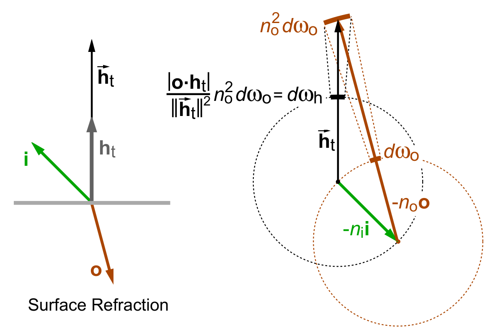

$$
\newcommand{\d}{\mathrm{d}}
\newcommand{\norm}[1]{\left\| #1 \right\|}
$$

# 前言

最近突然又想去搓一个离线渲染器作为玩具项目了，趁机深入看了下Disney Principled BSDF，也算是又从头学了一遍PBR，谨将所学的东西略微记下，以便后续查阅。

# 基本定义

由于Disney BSDF涉及大量的公式，这里有必要重新对于所有的公式和定义进行澄清。

## NDF

法线分布函数NDF究竟是什么？之前我的视线总是聚焦于具体的公式如Beckmann，GGX和GTR等等，很少会去关注NDF的定义。其实在不久之前，我还以为NDF就是法线分布的pdf，满足半球面上的积分为一即可，然而NDF的定义却并非如此。

 [1]中对于NDF的描述是 `the statistical distribution of surface normals m over the microsurface`，这里的$\mathrm{m}$指的就是微观法线，也就是我们常说的半程向量$\mathrm{h}$。乍一看这个定义似乎说的还是pdf，但NDF实际上是用微观面积与宏观面积的比值来定义的。具体来说，定义宏观面积的微元为$\mathrm{d}A$，微观法线$\mathrm{m}$对应的立体角微元为$\mathrm{d}\mathrm{\omega}_m$，那么$D(\mathrm{m})\mathrm{d}\mathrm{\omega}_m\mathrm{d}A$就等于（微观）法线朝向为$\mathrm{m}$微平面的总面积，因此$D(\mathrm{m})$项可以写为，其中$\mathrm{d}A_m$代表微平面的面积：

$$D(\mathrm{m})=\frac{\d A_m}{\d \mathrm{\omega}_m\mathrm{d}A}$$

然后来看下$D$的归一化条件，首先易得微平面投影面积的积分应该为$\mathrm{d}A$：

$$\mathrm{d}A=\int(n \cdot m)\mathrm{d}A_m$$

将$D(\mathrm{m})$的定义带入后可得真正的归一化条件：

$$\int_{\Omega}(n \cdot m)D(\mathrm{m})\mathrm{d}\mathrm{\omega}_m=1$$

之后就不要再天真地把$D(\mathrm{m})$项看作pdf了，而将其称为面积密度则更合适。

**P.S.** [1]中Walter et al. 实际上给出了更严格的归一化条件，即对于任意的方向$\mathrm{v}$需要满足：

$$\int_{\Omega}(v \cdot m)D(\mathrm{m})\mathrm{d}\mathrm{\omega}_m=(v \cdot m)$$

## Shadowing-Masking Function G

$G$项是为了能量守恒而加上的，用于描述有多少的微平面是在入射方向$\mathrm{}$$\mathrm{i}$和出射方向$\mathrm{}$$\mathrm{o}$上都是可见的，$G$要满足的三个条件分别是：

1. 位于0-1之间，这个没啥问题
2. 可逆性reciprocity， 交换$\mathrm{i}$和$\mathrm{o}$不影响$G$的值
3. 微平面始终只有一侧是可见的，即当$(\mathrm{i} \cdot \mathrm{n})(\mathrm{i} \cdot \mathrm{m}) \le 0$（$\mathrm{o}$同理）时$G$为0

由于$G$项依赖于微表面的细节，因此一般情况下不存在解析解，现有的模型如Smith包含了大量的统计近似和几何简化，这里就不再赘述。

Smith中为了满足可逆性，特意将$G$项设计为了可分离的形式（这似乎是个很通用的技巧，Kulla-Conty Approximation也是这么干的），即$G(\mathrm{i},\mathrm{o},\mathrm{m})=G_1(\mathrm{i},\mathrm{m})G_1(\mathrm{o},\mathrm{m})$。

## 微平面BSDF模型

既然已经准备深入PBR了，那微平面模型的推导肯定少不了，紧跟[1]的思路，可以得到一看看起来非常吓人的宏观表面BSDF积分定义，注意不是渲染方程的那个积分！

$$
f_s(\mathrm{i},\mathrm{o},\mathrm{m})=\displaystyle \int \left| \dfrac{\mathrm{i} \cdot \mathrm{m}}{\mathrm{i} \cdot \mathrm{n}} \right| f_s^m(\mathrm{i},\mathrm{o},\mathrm{m}) \left| \dfrac{\mathrm{o} \cdot \mathrm{m}}{\mathrm{o} \cdot \mathrm{n}} \right| G(\mathrm{i},\mathrm{o},\mathrm{m}) D(\mathrm{m}) \d\mathrm{\omega}_m \label{eq:1} \tag{1}
$$

其中$f_s^m(\mathrm{i},\mathrm{o},\mathrm{m})$为微平面本身的BSDF，虽然常用的模型都假设了微表面为镜面，但是这里暂时先只列出一般形式，这也是不把$\mathrm{m}$直接写作$\mathrm{h}$的原因。

为了搞懂这个式子，先关注后面的部分，$G$和$D$的乘积代表了微观法线朝向为$\mathrm{m}$的微平面面积之和占宏观面积的比例，这点很好理解。

最神秘的是那两个点积构成的系数，它们实则充当了宏观与微观间的桥梁，按照论文的意思就是，第一个系数会把incident irradiance从macro尺度转换到micro，第二个系数会把radiance转换回macro尺度。尝试着来理解下为什么要用到这两个系数。

### 第一个系数

宏观表面是与入射方向$\mathrm{i}$是成角度的，除以$(\mathrm{i} \cdot \mathrm{n})$，是为了抵消这个角度带来的衰减，还原真正的incident irradiance，也就是垂直辐照度。微观表面的法线也与入射方向$\mathrm{i}$有角度，既然有了真正的incident irradiance，那么只需要再乘上$(\mathrm{i} \cdot \mathrm{m})$就能得到微表面接收到的irradiance了。这两步合起来就是第一个系数了。

### 第二个系数

经过实际微表面的反射后就是出射的radiance了，不妨以radiant exitance（也就是出射的irradiance）作为桥梁把radiance从微观尺度转换为宏观尺度的数值。从radiance的定义出发，只要乘上$\mathrm{d}\mathrm{\omega}_o(\mathrm{o} \cdot \mathrm{m})$就能得到radiant exitance了；同样，radiant exitance除以$\mathrm{d}\mathrm{\omega}_o(\mathrm{o} \cdot \mathrm{n})$就是宏观的radiance了。这样我们就得到了第二个系数。

### 微表面的BSDF（BRDF+BSDF）

虽说上面是一般的式子，但是为了方便，大多数模型都会假定微平面是完全光滑的，只遵从Fresnel和Snell定律进行反射和折射。设$\rho(\mathrm{i},\mathrm{m})$代表散射的比例，$\mathrm{s}(\mathrm{i},\mathrm{m})$为理论上应该散射的方向，那么镜面的BSDF可以定义为：
$$
f_s^m(\mathrm{i},\mathrm{o},\mathrm{m})=\rho\dfrac{\delta_{\omega_o}(\mathrm{s},\mathrm{o})}{\left| \mathrm{o} \cdot \mathrm{m} \right|} \tag{2}
$$
上式中$\delta_{\omega_o}(\mathrm{s},\mathrm{o})$为仅在$\mathrm{s}$处有值的Dirac函数，分布上的点积是为了保证[能量守恒](https://en.wikipedia.org/wiki/Bidirectional_reflectance_distribution_function#Physically_based_BRDFs)而加上的。接下来就是考虑如何把这个式子应用到(1)中。

既然已经假定微表面是镜面了，半程向量$\mathrm{h}(\mathrm{i},\mathrm{o})$的概念也就可用了，用$\mathrm{h}$替代$\mathrm{s}$并带入到(2)中可得(3)。注意这里乘上Jacobian，是因为Dirac本身只有在积分时才是有意义的，(2)式只能算是一个简单写法；$\mathrm{s}$又与积分变量$\mathrm{o}$相关，所以在进行代换时需要乘上Jacobian才能保持积分值不变。
$$
f_s^m(\mathrm{i},\mathrm{o},\mathrm{m})=\rho(\mathrm{i},\mathrm{m})\dfrac{\delta_{\omega_o}(\mathrm{h}(\mathrm{i},\mathrm{o}),\mathrm{m})}{\left| \mathrm{o} \cdot \mathrm{m} \right|} \norm{\dfrac{\partial\mathrm{\omega}_h}{\partial\mathrm{\omega}_o}} \tag{3}
$$

#### Reflection BRDF

[1]和[3]中分别给出了Jacobian的计算方法，个人认为[3]中的比较清晰，在此复述一遍。下面的示意图来自[3]，注意图中的$\mathrm{o}$和$\mathrm{i}$和我们讨论中的定义相反，$\mathrm{m}$就是半程向量。下面会先按照图中给出的符号进行推导，最后再替换为我们的符号。


从几何关系中可以很容易看出固定$\mathrm{o}$时并移动$\mathrm{m}$时，$\d \theta_i=2\d \theta_m$，然后是比较有意思的一步，直接以$\mathrm{o}$而非$\mathrm{m}$作为up vector来建立球面坐标系，这样子$\theta_i$和$\theta_m$就成$\mathrm{i}$和$\mathrm{m}$与$\mathrm{o}$的夹角了，另外在retro reflection的情况下还能得到$\theta_i=\theta_m=0$，然后很容易就能看出（解一个微分方程）$\theta_i=2\theta_m$，将立体角表示为球坐标后开始计算Jacobian：

$$
\begin{aligned}
\dfrac{\d\mathrm{\omega}_h}{\d\mathrm{\omega}_i}
&= \dfrac{\sin \theta_m \d \theta_m \d \phi_m}{\sin \theta_i \d \theta_i \d \phi_i} \\
&= \dfrac{\sin \theta_m \d \theta_m \d \phi_m}{\sin 2\theta_m (2\d \theta_m) \d \phi_m} \\
&= \dfrac{\sin \theta_m}{4\sin \theta_m \cos \theta_m } \\
&= \dfrac{1}{4\cos \theta_m } \\
&= \dfrac{1}{4(\mathrm{i} \cdot \mathrm{m})} = \dfrac{1}{4(\mathrm{o} \cdot \mathrm{m})}
\end{aligned}
$$
来计算微表面的反射部分，直接把菲涅尔项和Jacobian带进去即可。注意$(\mathrm{i} \cdot \mathrm{h}_r)=(\mathrm{o} \cdot \mathrm{h}_r)$。
$$
f_r^m(\mathrm{i},\mathrm{o},\mathrm{m})=F(\mathrm{i},\mathrm{m})\dfrac{\delta_{\omega_o}(\mathrm{h}_r,\mathrm{m})}{4(\mathrm{i} \cdot \mathrm{h}_r)^2} \tag{4}
$$

#### Refraction(Transmission) BRDF

虽然[1]对于这部分的推导使用了折射半程向量$\mathrm{h}_t$的概念，但这里的$\mathrm{h}_t$实际上指的就是微平面的法线。这里还要做一些补充，笔者也是在写的时候才意识到，就是微平面$\mathrm{m}$实际上只是一个统计和建模上的概念，因为一个无限小平面的朝向是不可知的。唯一能做的就是从镜面的假设出发，通过实际观测到的$\mathrm{i}$和$\mathrm{o}$来算一个半程向量$\mathrm{h}$，并通过Dirac函数来筛选出朝向正好为$\mathrm{h}$的平面。因此，$\mathrm{h}_r$、$\mathrm{h}_t$和$\mathrm{m}$在实际计算时都是同一个向量，在折射的情况下称其为"*半程向量*"实际上是不名副其实的，不过为了推导上的统一我们就不再引入新的符号了。



如何计算微观法线呢？首先从上图的左边可以观察到$\mathrm{i}$和$\mathrm{o}$垂直于$\mathrm{h}_t$分量的模长分别为对应折射角的正弦值，同时分量的方向相反。根据斯涅尔定律$\eta_i\sin\theta_i=\eta_o\sin\theta_o$，两者相加正好完全抵消，剩下的部分正好是与微观法线共线的，做一次归一化就行了。记归一化与未归一化的半程向量分别为$\mathrm{h}_t$和$\vec{\mathrm{h}}_t$，则
$$
\vec{\mathrm{h}}_t=-(\eta_i\mathrm{i}+\eta_o\mathrm{o}), \mathrm{h}_t(\mathrm{i},\mathrm{o})=\frac{\vec{\mathrm{h}}_t}{\Vert \vec{\mathrm{h}}_t \Vert} \tag{5}
$$
至于Jacobian，[1]给出了几何的解释，如上图的右半部分。Gemini也给出了一个大概的推导，为了转换为立体角之间的关系，需要得到$\vec{\mathrm{h}}_t$和$\mathrm{o}$变化时微分面积的对应关系。首先在(5)式$\vec{\mathrm{h}}_t$的两端求导，得到$\d \vec{\mathrm{h}}_t=\eta_o \d \mathrm{o}$，这说明当$\mathrm{o}$变化时$\vec{\mathrm{h}}_t$扫过的微分面积是$\mathrm{o}$扫过面积的$\eta_o^2$倍。但这个面积是垂直与$\mathrm{o}$的，还要投影到垂直于$\vec{\mathrm{h}}_t$的方向上，因此还要乘上$\left| \mathrm{o} \cdot \vec{\mathrm{h}}_t \right|$才是真正的微分面积。根据立体角的定义，还要除以半径的平方，而$\norm{\vec{\mathrm{h}}_t}=\mathrm{h}_t \cdot \vec{\mathrm{h}}_t$，最终可以得到Jacobian为：
$$
f_t^m(\mathrm{i},\mathrm{o},\mathrm{m})=(1-F(\mathrm{i},\mathrm{m}))\dfrac{\delta_{\omega_o}(\mathrm{h}_t,\mathrm{m}) \eta_o^2}{(\eta_i(\mathrm{i} \cdot \mathrm{h}_t)+\eta_o(\mathrm{o} \cdot \mathrm{h}_t))^2} \tag{6}
$$
[4]中的一段也与这段推导相呼应：

```
Snell’s law describes the bending of rays, but less obviously, it also describes the spreading of rays. Specifically, the apparent radiance of a refracted ray will be scaled by η2 which, as Veach shows [Vea97], is equivalent to the change in projected solid angle.
```

当然，从上面的式子我们也能看出BTDF是不满足可逆性的，因为Radiance被缩放了$\eta^2$倍，双向的BTDF关系如下：
$$
\dfrac{f_t^m(\mathrm{i},\mathrm{o},\mathrm{m})}{\eta_o^2}=\dfrac{f_t^m(\mathrm{o},\mathrm{i},\mathrm{m})}{\eta_i^2}
$$

### BSDF

有了(1)、(4)和(6)式，我们终于能写出最终的BSDF了，由于Dirac函数的存在，宏观表面的BSDF可以看作是反射和折射两部分的叠加：
$$
f_s(\mathrm{i},\mathrm{o},\mathrm{n})=f_r(\mathrm{i},\mathrm{o},\mathrm{n})+f_t(\mathrm{i},\mathrm{o},\mathrm{n}) \tag{7}
$$
经过消元，反射部分为，就是我们熟悉的Cook-Torrance BRDF：
$$
f_r(\mathrm{i},\mathrm{o},\mathrm{n})=\dfrac{F(\mathrm{i},\mathrm{h}_r)G(\mathrm{i},\mathrm{o},\mathrm{h}_r)D(\mathrm{h}_r)}{4 \left| \mathrm{i} \cdot \mathrm{n} \right| \left| \mathrm{o} \cdot \mathrm{n} \right|}
$$

折射部分基本上没什么可消元的，就是单纯把微平面的$f_t^m$带进去即可：
$$
f_t(\mathrm{i},\mathrm{o},\mathrm{n})=\left| \dfrac{\mathrm{i} \cdot \mathrm{h}_t}{\mathrm{i} \cdot \mathrm{n}} \right| \left| \dfrac{\mathrm{i} \cdot \mathrm{h}_t}{\mathrm{o} \cdot \mathrm{n}} \right| \dfrac{\eta_o^2(1-F(\mathrm{i},\mathrm{h}_t))G(\mathrm{i},\mathrm{o},\mathrm{h}_t)D(\mathrm{h}_t)}{(\eta_i(\mathrm{i} \cdot \mathrm{h}_t)+\eta_o(\mathrm{o} \cdot \mathrm{h}_t))^2}
$$


# 杂记


# 参考

1. [Microfacet Models for Refraction through Rough Surfaces，GGX原论文，包含了对于微平面模型的完整推导过程](https://www.cs.cornell.edu/~srm/publications/EGSR07-btdf.pdf)
2. [How Is The NDF Really Defined?](https://www.reedbeta.com/blog/hows-the-ndf-really-defined/#you-found-a-secret-area)
3. [PBRTv4: Roughness Using Microfacet Theory](https://pbr-book.org/4ed/Reflection_Models/Roughness_Using_Microfacet_Theory)
4. [Extending the Disney BRDF to a BSDF with Integrated Subsurface Scattering](https://blog.selfshadow.com/publications/s2015-shading-course/burley/s2015_pbs_disney_bsdf_slides.pdf)
